**Master** What is the story?

> **Apprentice** I'm trying to translate this wireframe into a webpage. Can you help me?
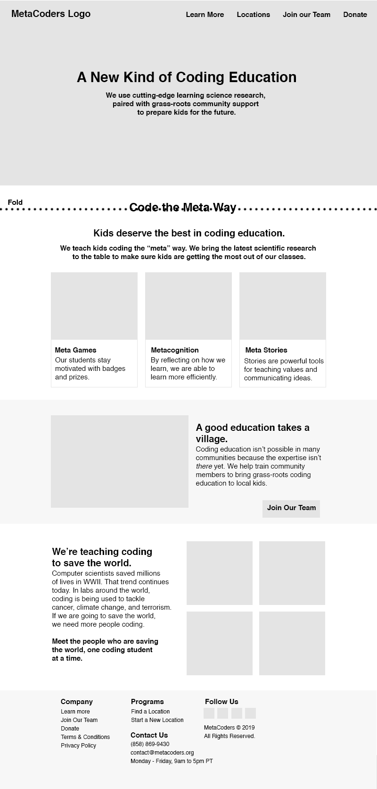


<details>
<summary>The story of transforming a wireframe into HTML/CSS with Racket</summary>

  
<details>
<summary>Hello World</summary>

**Master** The Racket `website` package would be perfect for this (https://github.com/thoughtstem/website).  Install it or update it.  In the docs, the `(render ...)` function has some sample code for making a single-page website.  Copy that into a Racket file and run it to generate a starter site.  (Post a screenshot when complete, please.)

> **Apprentice** I was able to get the starter site running:
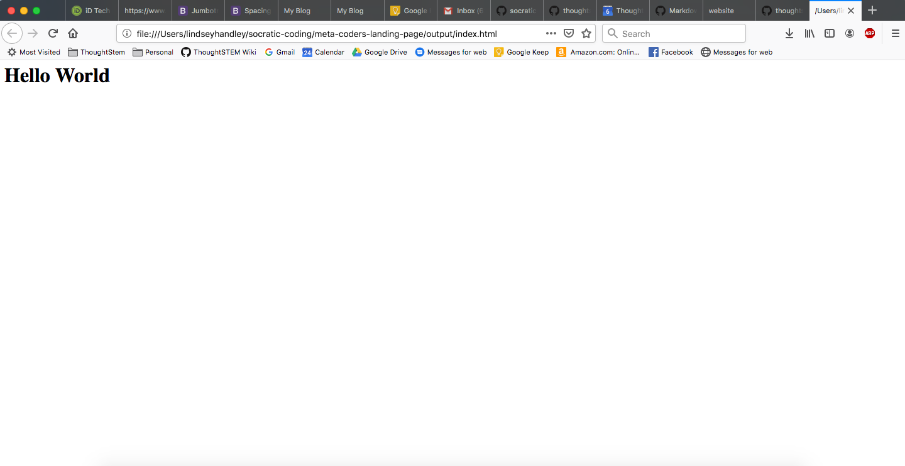
What should I do next?

</details>

<details>
<summary>Convert Hello World into template for organizing wireframe ideas</summary>

**Master** Your various sections in the wireframe look like bootstrap jumbotrons, so let's start with those.  Use `(div class: "jumbotron")` to make as many sections as there are in your wireframe.  (Screenshot when complete.)

> **Apprentice** It looks like it worked! 
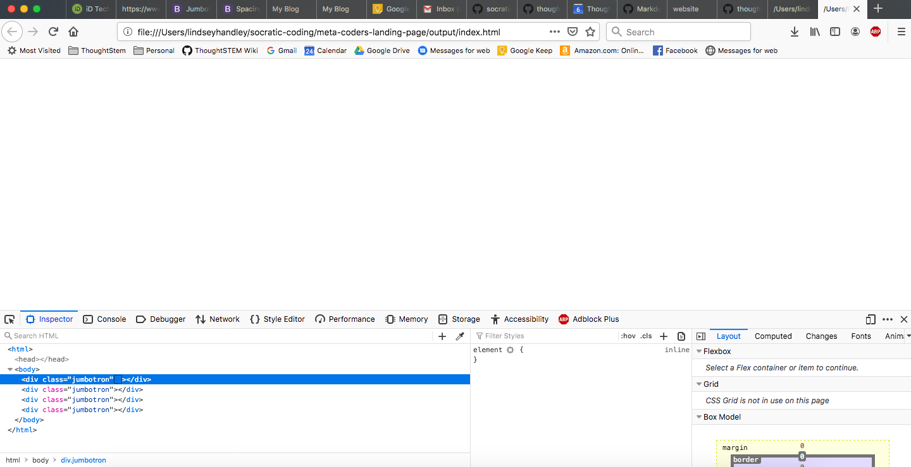
What should I do next?

<details>
<summary>Get bootstrap.css built into the site, and get the index.html page to include it</summary>

**Master** Almost.  Add `(bootstrap-files)` to the list of pages you're `(render ...)`ing (so the `bootstrap.css` gets rendered).  And wrap your page's content in `(content ...)` instead of `(html (body ...))` -- which will wrap your content in the correct `<html><head></head><body></body></html>` structure along with the necessary includes for bootstrap's css.  Oh, and put something in each jumbotron, so we can see if we're getting closer to the wireframe. (Screenshot.)


> **Apprentice** I ran into an error while I was trying to add `(bootstrap-files) to the list of pages I'm rendering. What did I do wrong?
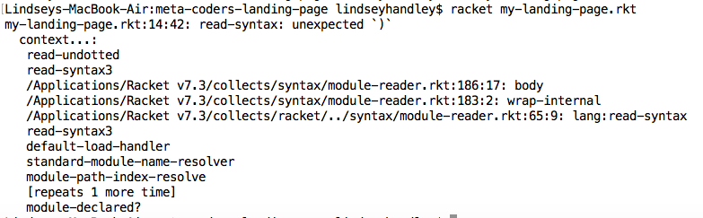
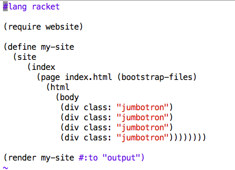

**Master** 
  1) `(bootstrap-files)` needs to be outside of your index page.
  2) That `(index ...)` wrapper doesn't need to be there.
  3) Change `site` to `list`.  I'm deprecating `site`, and I need to update that in the `website` docs.   I will do that now.

> **Apprentice** Getting closer I think! It looks like it's not recognizing `(bootstrap-files).
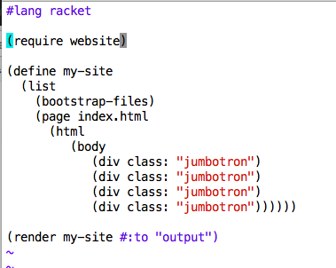
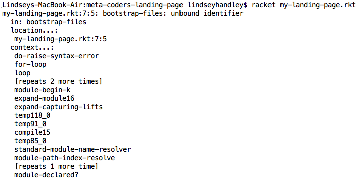


**Master** `(require website/bootstrap)`.  While you're at it, update `website` and change your `(div class: "jumbotron" ...)`s to `(jumbotron ...)`.  I added that to the language just now.

> **Apprentice** I updated `website` with `raco update pkg website`. But it's not recognizing the jumbotron function yet:
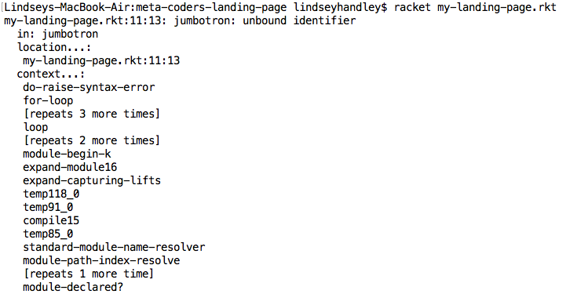
I grepped for "jumbotron" in `website` but couldn't find is except in .css files.

**Master** As you can see from my last commit to https://github.com/thoughtstem/website, there is a jumbotron function now.  Do the usual checks: Are you really sure you updated?  If so, find the package on your system, fine the bootstrap.rkt file,  verify there is a bootstrap function, etc.  Basically: Prove to me you got my update.

> **Apprentice** I had to pull from Github to get this work! Now it recognizes `(jumbotron)`, but doesn't like the ellipses:
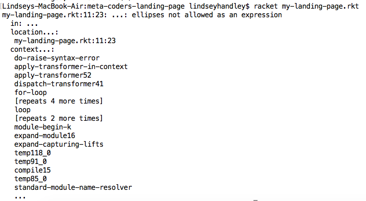
 
**Master** Don't do ellipses.  Those are meta characters. Put some content in there.  And don't do `(html (body ...))`, do `(content ...)`.

> **Apprentice** It's working! Check out what I have so far:
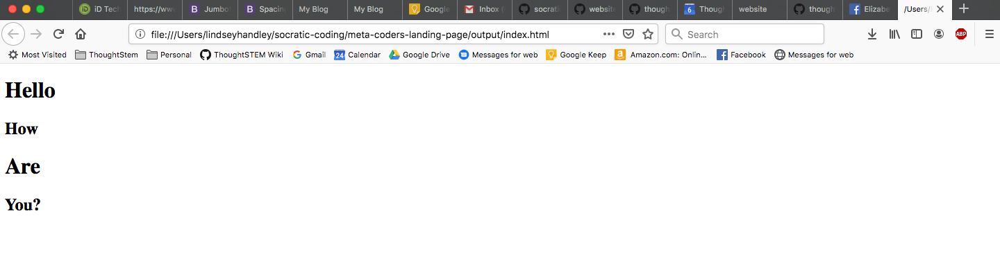
What should I do next?

**Master** Those don't look like jumbotrons yet... Your page is not getting your css.  I can see from your screenshot you're viewing at `file://`.  When you develop with `website`, you should have a terminal running `raco website-preview` in your output directory.  I'll make that clearer in the docs.

> **Apprentice** Ohhhhh! Ok, it looks more jumbotron-y now:
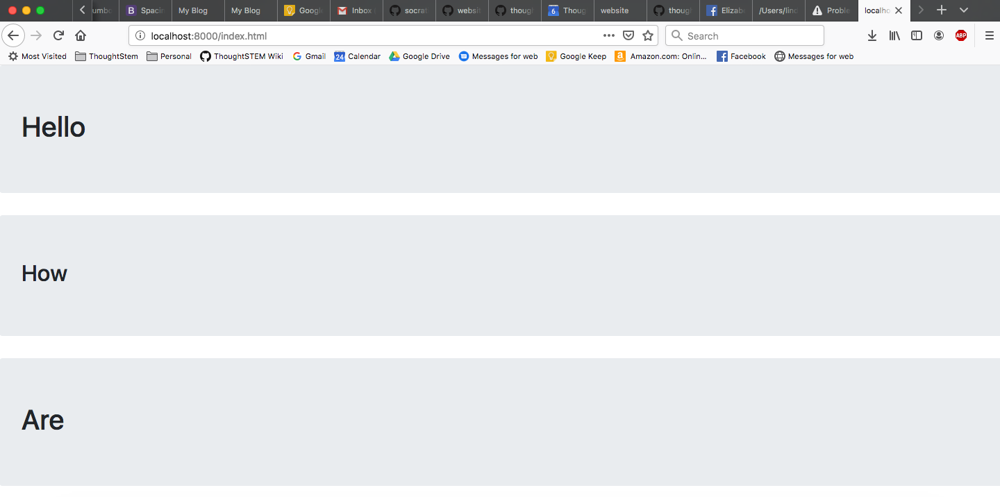
What should I do next?

</details>
</details>

<details>
<summary>Design guidance toward vision</summary>

**Master** Ignore the navbar for now.  Make the content look as close to your wireframe as possible in each jumbotron.  Use basic html tags -- e.g. `(h1 ...)`, `(h2 ...)`, etc.  Get as close as possible using those for typesetting.  Post a screenshot when you can't make it closer with what you know (and what you can find on the `website` docs).

> **Apprentice** This is as far as I could get:
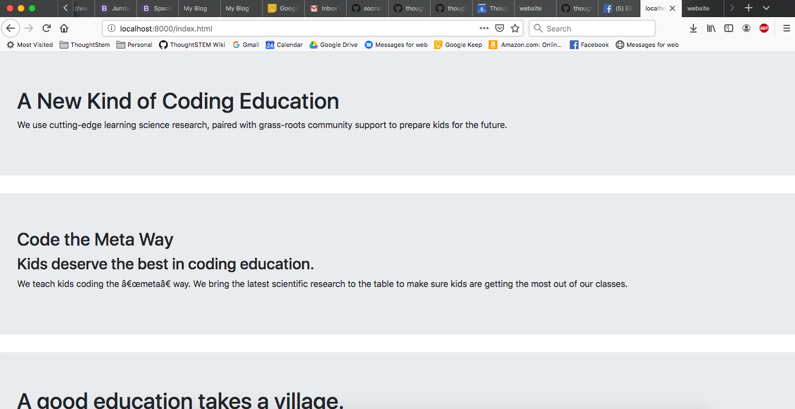
How do I justify text to the left, right, or center?

**Master** Use css attributes.  E.g.

```
(div style: (properties
             background-color: "red"
             color: "green")
 "I am a weird div tag from the 90s"))
 ``` 

But use `text-align:` instead (https://www.w3schools.com/cssref/pr_text_text-align.asp).

> **Apprentice** I got the centering to work!
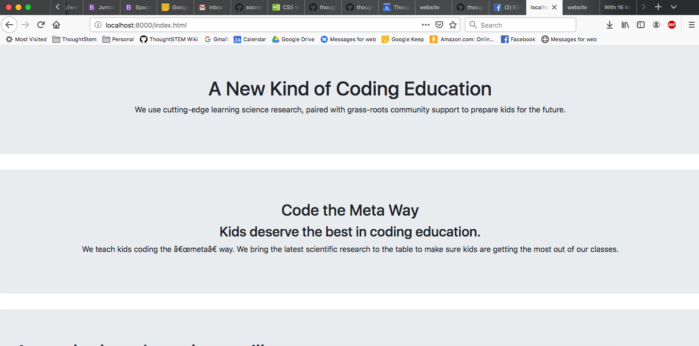

**Master** Cool.  Pick a part that you want to look more like the wireframe.  You're the question asker in this dialogue.  I just assign work.

> **Apprentice** Whoops. I lost my question between commits. Here it is: I noticed the apostrophe's are printing strangely: "We teach kids coding the “meta” way." Is there a fix for that? Also, I'd like to add 3 bootstrap cards in the 2nd jumbotron.

**Master** You have non-ASCII characters in your strings.  Hunt them down and replace them with the escaped equivalents: e.g. `\"`  

> **Apprentice** Awesome! These look good now:
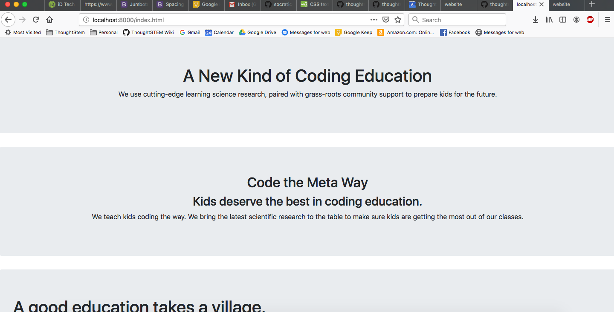

Can you help me with those 3 bootstrap "cards" now?

**Master** It's in the docs, but here's a card example:

```
(card
  (card-img-top)
  (card-body
    (card-title "I am a card")
    (card-subtitle "with a subtitle")
    (card-text "Lorem ipsum ....")
    (button-primary
      "Learn More")))
```

(Note that in bootstrap, you don't have to pass all of those things in.  If you don't want a button, you can omit it.  Same for almost everything.)

</details>

 </details>

